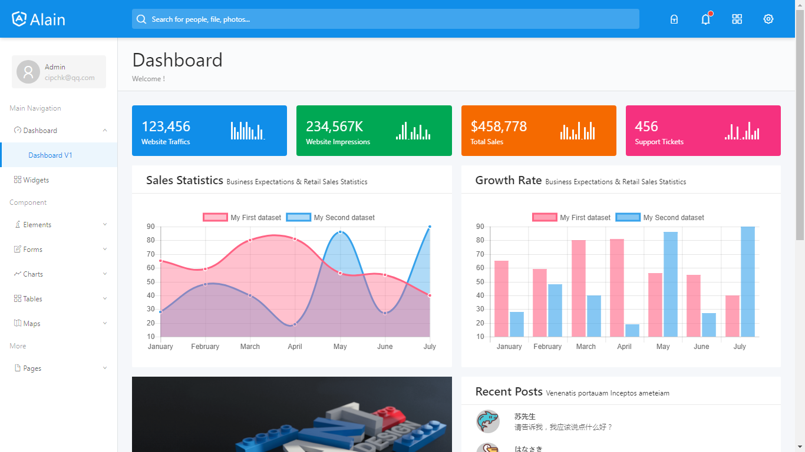
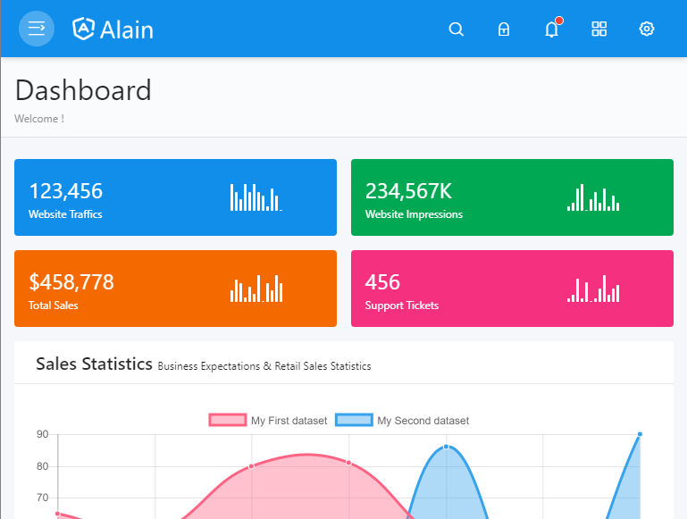
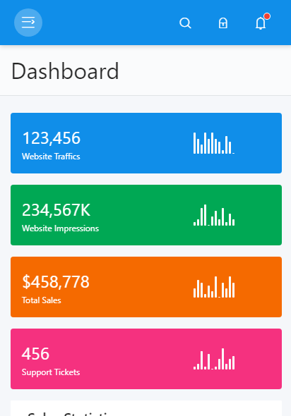

[](https://travis-ci.org/cipchk/ng-alain)
[](https://david-dm.org/cipchk/ng-alain)
[](https://www.npmjs.com/package/ng-alain)

# ng-alain

[Ng-zorro-antd](https://github.com/NG-ZORRO/ng-zorro-antd) admin panel front-end framework.

更多信息见[中文 README](README-zh_CN.md)

[DEMO](https://cipchk.github.io/ng-alain/)

## Quick start

Make sure you have Node version >= 6.9.0 and NPM >= 3 or higher.

```bash
# clone ng-alain repo
# --depth 1 removes all but one .git commit history
git clone --depth 1 https://github.com/cipchk/ng-alain.git

# change directory
cd ng-alain

# install npm package
npm install
# in china please use cnpm （https://github.com/cnpm/cnpm）
# cnpm install

# start the serve
npm start

# use HMR
npm run serve:hmr
```

> [vscode] recommended install [ng-zorro-vscode](https://marketplace.visualstudio.com/items?itemName=cipchk.ng-zorro-vscode) plugins, that includes `nz-alain-*` snippets.

## Links

+ [Document](http://ng-alain.com)
+ [@delon](https://github.com/cipchk/delon)
+ [DEMO](https://cipchk.github.io/ng-alain/)

## Features

+ `ng-zorro-antd` based
+ Responsive Layout
+ I18n
+ ACL
+ Lazy load Assets
+ UI Router States
+ Multiple color options
+ Less preprocessor
+ Well organized & commented code
+ Simple upgrade
+ Hot Module Replacement
+ Support [Docker](_documents/docker.md) deploy

## App Shots





## Troubleshooting

Please follow this guidelines when reporting bugs and feature requests:

1. Use [GitHub Issues](https://github.com/cipchk/ng-alain/issues) board to report bugs and feature requests (not our email address)
2. Please **always** write steps to reproduce the error. That way we can focus on fixing the bug, not scratching our heads trying to reproduce it.

Thanks for understanding!

### License

The MIT License (see the [LICENSE](https://github.com/cipchk/ng-alain/blob/master/LICENSE) file for the full text)
